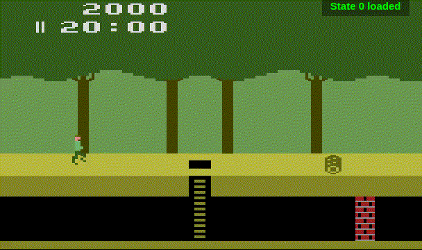

# Pitfall-Agent-Javatari

This repository is a fork of the [Javatari.js](http://javatari.org/) Atari 2600 emulator that has been modified to automatically play the game Pitfall.  An agent controls the player and through trial and error discovers a path through the game.

In its current state this is a proof of concept, no doubt with several bugs and some large improvements just steps away.  The agent logic relies on taking random actions and saving what works.  Given enough time to train it is likely that this could progress far into the Pitfall world.

# Usage

A pre-built release is included in the repository and may be run by pointing a browser at a local copy of [release/index.html](release/index.html).  To begin, insert a cartridge.  This will start the agent and create a small user-interface below the console image.  The cartridge should be a Pitfall ROM.  Anything else won't likely have useful results.  A new release can be built using Grunt.

The controls of Javatari have not been disabled.  Using game controls can mess up the training.  For example, if you help Harry jump over a log, your keys won't be recorded, so he may move to the next screen, but he'll never be able to replay his steps back to that point.

Once the game is running there isn't much to do other than watch and check back occasionally.  Some of the screens will be beat in minutes, but the more challenging ones can take many hours to solve.

## Logging

After loading a cartridge, a `pitfallAgent` object appears the JavaScript window name space.  This allows access to the agent's API and internals, and it is mostly intended for debugging.

By default, some basic logging to the console of the browser is enabled.  The level of detail can be controlled with`pitfallAgent.setLogLevel(LEVEL)`.  The default is 1, and higher numbers will generate more detailed logs.

# How Does it Work?

## Algorithm

The current algorithm begins by holding the joystick right.  It then randomly chooses between five actions for random durations.  These actions include leaving the buttons unchanged, standing still by releasing the right control, pressing the right control again, jumping, and pressing down on the joystick to drop from a vine.

The agent is very unaware of the world.  It looks at the score and the player's height, and if either go down, it resets.  This means the agent currently can only play a game on the surface, and that an optimal game where all treasures are gotten in the shortest time is not possible.

This version has an optimization where the agent is allowed to check if it is on a vine.  To save on wasted actions the down button will only be pressed when on a vine.  This was done to make the training go faster, but for the purists it can easily be disabled.

Pitfall's design includes obstacles (such as the alligators) that can take a very long time to randomly get past with this style.  It is very possible to modify the algorithm to more optimally handle these situations.  While there are more interesting algorithms in machine learning, the chosen style demonstrates the possibility of using an extremely simply algorithm to progress through the world.

The algorithm treats each screen as an independent level to be solved.  Once a screen is solved the instructions for it are solidified.  There is no optimizing, so things like pointless random delays will exist.

On any screen random actions are chosen and if they don't help the player get further, they are discarded.  In a situation where they do help the player get further, they may be discarded anyway, since some obstacles (such as the disappearing lakes) would otherwise be impossible.  A solution that makes it further is given a number of tries to progress again, and if it fails, the list of commands is cut back to an earlier point.

## Javatari.js Modifications

Javatari.js was a great platform for writing this on top of. The code was very clean and straightforward.  Some modifications were needed, since it lacked event hooks and tended to define interfaces privately.

Some functions were converted to public interfaces and new functions were added to provide access to private resources (ram, cpu, bus.) Event hooks were added so that we can get a call each CPU cycle (for input injection) and every time the PC matched a value.  The latter was set against a VSYNC completing, and used to check on and update the game state.  A cycle counter was also added, so that we could be sure input was injected at the same point each run.

## Notes on the Internals

The agent has a set of functions that read values directly out of the 2600's RAM. This is needed for doing things like reading the score or finding out the players position.

The emulator [Stella](http://stella.sourceforge.net/) was used to figure out the needed internal addresses.  Stella is a 2600 emulator that has been around for over 20 years.  It includes a full debugger, which made finding the needed addresses simple.

Checkpointing is done any time the player makes it to a new screen.  This involves saving the state of the emulator and the agent.  When resetting, if a checkpoint exists, it is loaded instead of starting from the beginning to save on the need to walk through all the screens that have already been solved.

LocalStorage is used to store the game state at the time of a checkpoint so that it may be reloaded even if the browser exits.

The game defaults to running at a faster than normal clock speed so that it can train quicker.

A small user interface is added after inserting a cartidge that allows controls over whether checkpointing and the faster clockrate are enabled.  It also has a button that clears out the training data when pressed, including localStorage.

# Known Issues

## Drift

Occasionally when loading a saved run things will be slightly out of sync, and so the instructions that previously worked will fail.  It isn't yet clear what causes this.   Input is injected with the same way at the same CPU cycle, so this should not be possible.  There must either be a bug or an incorrect assumption over how things work.

Often times this can be remedied be reloading and trying again.

* [Issue Tracking](https://github.com/DougHaber/pitfall-agent-javatari/issues/1)

## Running Simultaneous Copies

Running multiple copies of this or Javatari in the same browser is not supported.  Saved states are placed in localStorage.  Multiple copies of the game will clobber each other's saves and have undesirable results.

# License

Javatari.js is distributed under version 3 of the [GNU Affero General Public License](https://www.gnu.org/licenses/agpl-3.0.en.html) (AGPLv3).  The code for the agent is integrated into Javatari.js, and so is distributed under the same license.
